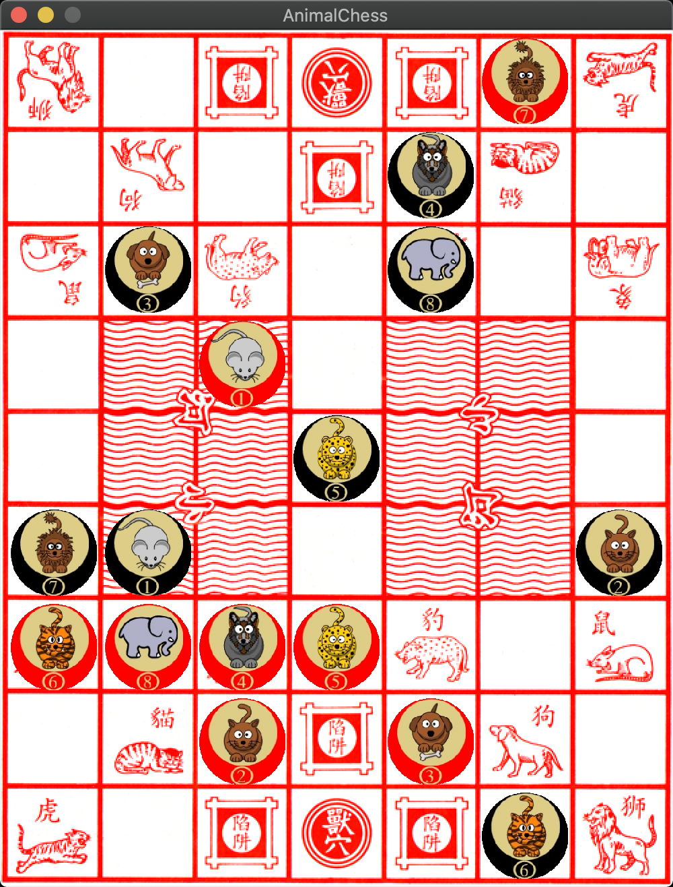

## Animal Chess
Animal Fight Chess Game（斗兽棋） written in rust, using Alpha-Beta-Pruning algorithm, and implement AlphaZero algorithm for training.



## How To Play
To win the game, one player must successfully move any animal into the Den（兽穴） of the opponent.
See rules:
- [http://ancientchess.com/page/play-doushouqi.htm](http://ancientchess.com/page/play-doushouqi.htm)
- [https://en.wikipedia.org/wiki/Jungle_(board_game)](https://en.wikipedia.org/wiki/Jungle_(board_game)).

## How To Run
It need rust nightly version.

### Prerequisite
```
$ rustup default nightly
```

### Play
```
$ git clone https://github.com/netcan/AnimalChess.git
$ cd AnimalChess
$ cargo run --release
```

### Developing
```
$ sudo apt-get install python3-dev python-dev
$ pip3 install virtualenv ipython
$ cd pymodule
$ virtualenv venv
$ source venv/bin/activate
(venv) $ pip install -r requirements.txt
(venv) $ maturin develop
(venv) $ ipython
In [1]: import animal_chess_pymodule

In [2]: board = animal_chess_pymodule.Board('l5t/1d3c1/r1p1w1e/7/7/7/E1W1P1R/1C3D1/T5L w - - 0 1')

In [3]: board
Out[3]:
l #@# t
 d # c
r p w e
 ~~ ~~
 ~~ ~~
 ~~ ~~
E W P R
 C # D
T #@# L

In [4]: board.generate_all_steps()
Out[4]:
[24688,
 24673,
 24656,
 25202,
 25187,
 25185,
 25716,
 25701,
 25699,
 26230,
 26198,
 26213,
 29057,
 29042,
 29025,
 29040,
 30085,
 30070,
 30053,
 30068,
 32897,
 32880,
 34422,
 34437]

In [5]: board.move_chess(24688)

In [6]: board
Out[6]:
l #@# t
 d # c
r p w e
 ~~ ~~
 ~~ ~~
 ~~ ~~
  W P R
EC # D
T #@# L
```

## Todo
- [x] Seperate `game.rs` to `gui.rs` and `board.rs`
- [x] Add `Monte Carlo Tree Search` Algorithm
- [x] benmark board operation
- [x] export module for python3
- [x] add some test
- [x] benmark pymodule
- [x] encode/decode move
- [x] generate fen
- [x] repr board
- [x] patch sdl2 to support `load_texture` from buffer
